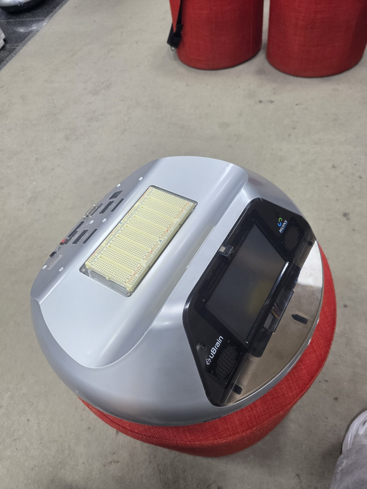
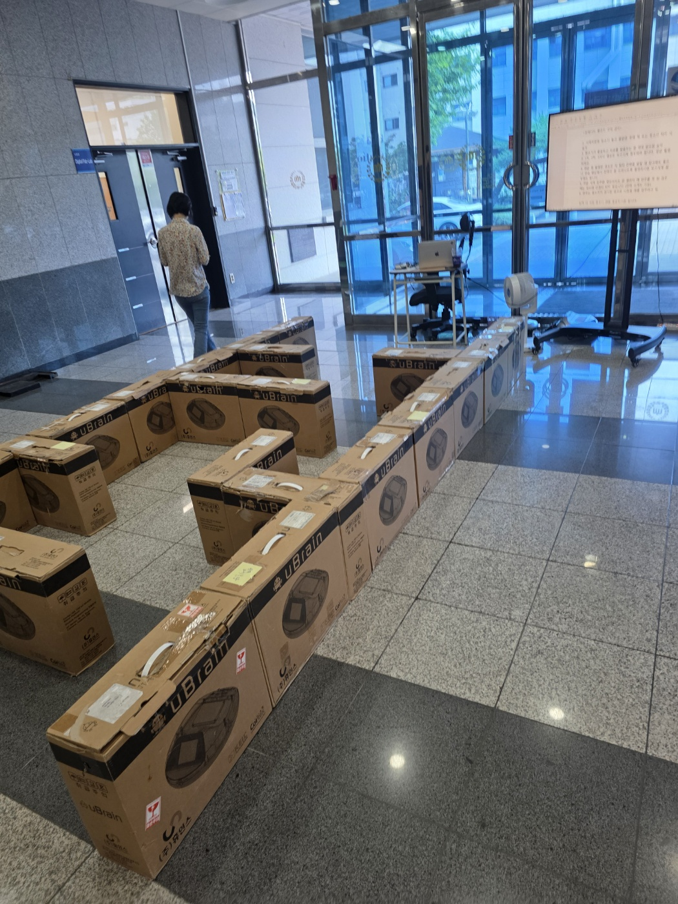
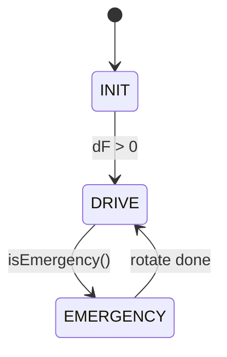
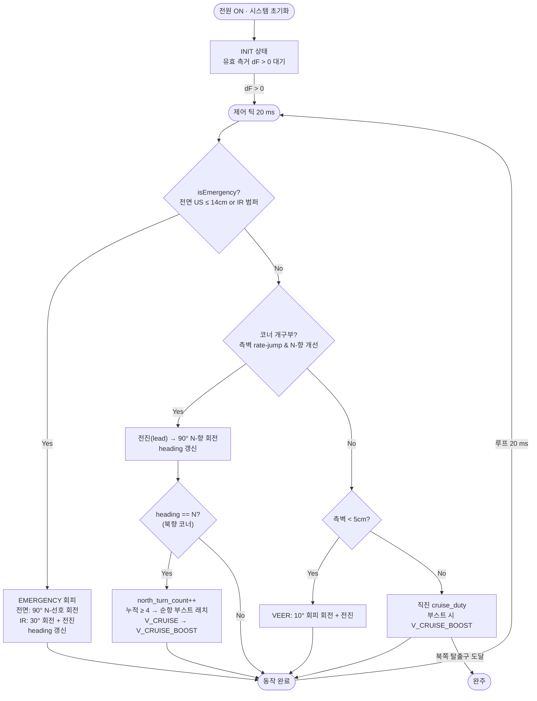

# 초음파·적외선 센서 기반 자율주행 프로젝트



>
> | 이름 | GitHub |
> |---|---|
> | 정준모 | [@i3months](https://github.com/i3months) |
> | 김민수 | [@new-borned](https://github.com/new-borned) |

STM32F429(Cortex-M4) + FreeRTOS 기반으로 초음파 센서 3개와 적외선(IR) 센서 2개를 융합하여, 사전 전역 경로 없이 북쪽(North) 탈출구로 수렴하는 미로 자율주행 로봇입니다.

최종 아키텍처

> 하드코딩한 미로(고정 벽) + EKF 센서 퓨전 + Greedy Cardinal 내비게이션 + 결승 직전 동적 장애물 확률 모델링

---

## 1. 문제 정의와 설계 철학

미로는 약 5 m × 10 m 직사각형 공간이며, 출발선에서 출발해 북쪽 탈출구에 충돌 없이 가장 빠르게 도달하는 것이 목표입니다. 장애물은 uBrain 포장 박스로 구성된 고정형 장애물과 이동형 uBrain 1대(동적 장애물)로 구분됩니다.



> 당일 오전 공개된 미로 맵. 모든 벽이 직교(orthogonal)이며 탈출구는 북쪽에 위치한다.

핵심 가정은 다음과 같습니다.

- 탈출구는 반드시 북쪽에 위치한다.
- 미로는 'ㅁ'형(고립 루프) 맵이 아니다.
- 탈출구 도달에 필요한 방향 전환 횟수가 정해져 있다.

이 강한 가정 위에서 완전성이 보장되므로, 문제를 "디바이스에 방향 정보를 제공하여 북쪽 탈출구로 안정적으로 수렴시키는 그리디 문제"로 재정의했습니다.

### 풀스택 내비게이션을 기각한 이유

초기에는 Occupancy Grid 기반 mapping → 벽 추출 → A\*/D\* 전역 경로계획을 통합한 풀스택 자율주행 파이프라인을 구현·실측했습니다. 그러나 실측 결과,

1. 우리 팀 로봇의 좌·우 모터 출력 비대칭이 타 팀 대비 컸고,
2. 보드에 IMU 센서가 부재하여 부정확한 상태 추정이 불가피했습니다.

이로 인해 자세 추정의 누적 오차가 커져 Occupancy Grid 매핑 시 오히려 주행 안정성이 떨어졌습니다. 대신 당일 오전에 맵이 공개된다는 점에 착안하여, 2D 맵을 하드코딩하고 동적 장애물 구간만 y좌표 임계점으로 확률 모델링하는 방향으로 설계를 축약했습니다.

> 이론적 최적성보다, 하드웨어 제약 하에서 견고성을 보장하는 알고리즘이 임베디드 시스템에서 더 중요하다고 판단했습니다.

---

## 2. Finite State Machine 기반 구조

미로에는 곡선 구조가 전혀 없고 모든 구성이 직교(orthogonal)입니다. 따라서 로봇의 주행을 상하좌우 + 90° 코너 회전으로 단순화할 수 있고, 복잡한 경로 추종 로직 대신 FSM으로 환원했습니다.



| 상태 | 역할 |
|---|---|
| `INIT` | 전원 인가 후 유효 측거(`dF > 0`) 대기 |
| `DRIVE` | 코너 판정 · VEER · 직진 등 정상 주행 |
| `EMERGENCY` | 전면 충돌 임박(초음파/IR) 시 회피 회전 후 복귀 |

> 이 FSM이 제대로 작동하려면 직진 수렴성과 90° 회전 정밀도가 매우 중요합니다. 회전·직진이 조금만 어긋나도 오차가 누적되어 경로가 무너지므로, 회전·직진 보정을 집중적으로 검토했습니다.

---

## 3. 핵심 주행 알고리즘

### 3.1 Greedy 북향 내비게이션 (Cardinal FSM)

Non-wall-following 방식으로, 측벽 거리의 변화량 Δd를 기준으로 코너 및 교차로를 이산 감지하여 회전·통과합니다. 의사결정은 항상 북쪽(도착지)을 선호하도록 설정했습니다.

- 진행 방향에 우선순위를 부여한다: 북:0, 서·동:1, 남:2.
- 90° 회전(EMERGENCY 포함) 시 이 우선순위로 회피 방향을 결정한다 (priority-prefer rotation).
- 우선순위가 동일하면 좌·우 센서 값을 비교해 더 넓은 쪽으로 진행한다.
- 교차로 판별 시 북향 진행이 가능하면 북쪽을 강제 선택한다.

이로써 북향 단조 구조 가정 하에서 사전 전역 경로 없이도 출구 도달이 보장됩니다. 절대 좌표가 아니라 국소 측벽 거리와 cardinal heading(상대 방향)으로 분기를 판단하므로, 위치 추정 누적 오차(drift)에 강합니다.

### 3.2 동적 장애물 확률 모델링

이동형 uBrain 1대는 위치가 변하므로 하드코딩 맵으로 다룰 수 없고, IMU·정밀 센서가 없는 보드에서 이동체를 정밀 추적하는 것은 오히려 불안정합니다. 따라서 정밀 추적 대신 관측-후-결단 휴리스틱을 채택했습니다.

- 결승점 직전 마지막 구간(실습 채점 기준 4구간)에 진입하면 동적 회피 모드를 활성화한다.
- 센서 빔 종점에 점유 확률을 시간 가중으로 누적·감쇠시켜 정적 벽과 이동 물체를 분리한다.
- 로봇은 N회 북향 사이클을 수행하며 이동 장애물의 통과 리듬·간격을 기록한다.
- 전면이 임계 거리 이상으로 열린 통과 창(window)이 확인되면 순항 속도를 일시적으로 높여(`V_cruise → V_dash`) 장애물이 되돌아오기 전에 빠르게 통과한다.

```
if ( front_clear ≥ D_pass  AND  cycle_count ≥ N )  ⇒  v ← V_dash
```

> 설계 근거: 정확한 위치·속도 추정엔 고품질 센서·필터가 필요하지만, "통과 가능한 시점만 포착"하는 문제로 환원하면 저품질 센서로도 충분합니다. 확률 감쇠 덕분에 한 번의 순간적 감지가 통로를 영구 차단하지 않으며, N회 관측은 우연한 오감지에 의한 무모한 돌진을 막는 안전장치로 작동합니다.

### 3.3 교차로 판정 + 정지시간 보정 함수

측벽 개구는 저성능 측면 초음파 센서로 판정하므로, 단발 스파이크가 아닌 일정 시간 지속적으로 열려 있는지를 확인하도록 증거를 누적하고 시간이 지나면 leak 하는 구조로 만들었습니다.

$$w_{open}(t) = \alpha \cdot w_{open}(t-1) + (1-\alpha)\cdot \mathbf{1}[\Delta d(t) > \tau_\Delta]$$

- $\alpha \in (0,1)$: 누수 계수(클수록 과거 증거 오래 유지). 보통 0.7 ~ 0.9.
- $\mathbf{1}[\cdot]$: 이번 틱에 개구 조건 만족이면 1, 아니면 0.
- 판정: $w_{open}(t) > \theta_{trigger}$ 이면 개구 확정.

연속적으로 여러 tick이 열려야 임계를 넘으므로 오판이 억제되고, 한 번 판단한 교차로를 즉시 재트리거하지 않는 debounce 효과도 부수적으로 얻습니다.

정지시간 보정: 개구 판정 즉시 회전하면 교차로 중앙이 아닌 진입부에서 돌아 벽에 충돌합니다. 진행 시간을 단일 상수로 하드코딩하면 속도에 따라 회전 위치가 흔들리므로, 직전 `motor_stop()` 이후 경과 시간 Δt를 현재 속도의 대리 변수로 삼아 진행 시간을 정의했습니다.

$$t_{advance}(\Delta t) = \max(800,\; 900 - 50\,\Delta t), \quad \Delta t = t_{now} - t_{last\\_stop}$$

이로써 교차로 판단의 안정성과 반응성을 동시에 확보합니다.

---

## 4. 오류 보정 전략 — 극한의 Calibration

> 가장 많은 시간을 투자한 영역입니다. 이상적 알고리즘이 현실 하드웨어에서 그대로 동작하지 않으므로, 물리 오차를 추적·보정하는 일이 매우 중요했습니다.

### 4.1 물리 계층 디버깅

| 문제 | 원인 | 대응 |
|---|---|---|
| 배터리 의존성 | 충전 상태에 따라 좌·우 모터 거동이 달라져 직진이 휘고 90° 회전이 어긋남 (`TICKS_PER_CM`, pivot substep이 배터리 상태에 따라 변함) | 항상 100% 충전 상태를 가정해 Calibration, 실전에서도 풀충전 유지. 회전을 인코더 폐루프로 구현해 자가보정 |
| 바퀴에 엉킨 머리카락 | 우측 바퀴 축에 머리카락이 엉켜 회전을 물리적으로 방해 → 좌·우 인코더 값 비대칭 | 하드웨어 직접 점검 후 제거하여 좌우 대칭성 회복 |
| 좌·우 모터 비대칭 | 받은 로봇의 구조적 출력 편차 | 직진·드리프트용 `V_TRIM_L`, 회전용 좌/우 분리 substep, 폐루프 pivot으로 비대칭 억제 |

### 4.2 (5-a) Wheel Odometry — RK2(midpoint) 적분

EXTI 인코더 ISR이 quadrature edge마다 좌·우 휠 카운터를 증감하며, uint16 wrap을 signed delta 캐스팅으로 보정해 한 tick에 $|\Delta| < 2^{15}$ 범위까지 안전합니다.

좌·우 휠 변위로부터 본체 변위 Δs와 회전 Δθ를 계산합니다.

$$\Delta s_R = \Delta\\_R / K, \quad \Delta s_L = \Delta\\_L / K$$
$$\Delta s = (\Delta s_R + \Delta s_L)/2, \quad \Delta\theta = (\Delta s_R - \Delta s_L)/b$$

한 tick 동안 헤딩이 선형 변화한다고 보고 평균 헤딩을 사용한 중점(RK2) 적분으로 1차 Euler보다 한 차수 높은 정확도를 확보합니다.

$$\alpha = \theta + \Delta\theta/2$$
$$x \leftarrow x + \Delta s\cos\alpha, \quad y \leftarrow y + \Delta s\sin\alpha, \quad \theta \leftarrow \theta + \Delta\theta$$

- Calibration: `TICKS_PER_CM = 50.8` (직진 3 s × 3회, 분산 < 1 %), `WHEEL_BASE_CM = 22.0` (캘리퍼 실측 후 정사각 테스트로 재보정). 20 ms 주기로 `SensorTask`가 호출.

### 4.3 (5-b) EKF 센서 퓨전 (Predict + Update)

상태벡터 $x = [x, y, \theta]^T$, 공분산 $P \in \mathbb{R}^{3\times3}$. X·Y는 모터 인코더 적분, θ는 센서값 기반으로 보정되는 구조로, 인코더의 누적 드리프트를 초음파 센서가 잡아줍니다.

Predict — 비선형 운동모델을 전파하고, 상태 Jacobian F·제어 Jacobian V로 공분산을 propagate. 노이즈는 휠 슬립을 변위 비례로 모델링 후 V로 투영하여 (x,y,θ) 상관관계를 보존합니다.

$$P^- = FPF^\top + Q, \quad Q = VQ_{uu}V^\top, \quad \sigma_i = \max(k_{slip}|\Delta s_i|, \sigma_{floor})$$

해석적 Ray–Segment 교차 — 측정값은 초음파 3개의 거리 $(z_F, z_L, z_R)$. 격자 ray-cast 대신 하드코딩된 벽 선분 리스트와 빔의 해석적 교차로 측정 야코비안 H를 닫힌 형태로 계산합니다.

$$\hat{z}_i = \frac{d_j - n_j \cdot o_i}{n_j \cdot \hat{b}_i}$$

센서별 순차 1D 갱신 — R이 대각이므로 3센서를 동시에 처리하지 않고 순차 1D Kalman update로 처리하여 행렬 역연산을 회피합니다.

$$y = z_i - \hat{z}_i, \quad S = H_iPH_i^\top + \sigma_{z,i}^2, \quad K = PH_i^\top/S$$

이노베이션 게이팅 + Joseph form — 잘못 정의된 벽으로 인한 EKF 발산을 막기 위해 $|y| > 3\sqrt{S}$ 인 센서 행을 제외하고, 공분산은 Joseph form으로 갱신하여 대칭 양정치(PD)를 보존합니다.

$$|y| > 3\sqrt{S} \Rightarrow \text{reject}; \quad P^+ = (I - KH_i)P(I - KH_i)^\top + KRK^\top$$

### 4.4 (5-c) arctan 기반 헤딩 추론

직진·90° 회전 가정의 성패가 헤딩 정확도에 달려 있으므로, 인코더 적분으로 얻은 절대 헤딩 θ에 더해 측벽 형상으로부터 산출한 헤딩으로 보정합니다. 측면 초음파가 동일 벽까지 측정한 앞뒤 거리차 Δd와 두 측정점의 종방향 베이스라인 L로부터,

$$\theta_{rel} = \arctan(\Delta d / L)$$

사전 공개된 하드코딩 맵에서 현재 추종 중인 벽의 절대 방향 $\theta_{ref}^{wall}$(cardinal 이산값)을 알 수 있으므로, 로봇의 절대 헤딩 관측값을 $z_\theta = \theta_{ref}^{wall} + \theta_{rel}$ 로 환산해 EKF 측정 갱신에 반영합니다. 이를 통해 IMU 부재로 인한 헤딩 드리프트를 절대 기준에 고정(anchor)합니다. 단, 교차로에서는 평행 벽 가정이 깨져 $\theta_{rel}$이 발산하므로 측벽 변화량이 임계를 초과하는 개구 이벤트 시 해당 관측을 일시 중단합니다.

---

## 5. 센서 활용 전략 (초음파 + 적외선)

두 센서의 역할을 분리하여 상호 보완합니다. 초음파는 전역 측거 및 항법, 적외선은 근접 범퍼를 담당합니다.

| 센서 | 구현 및 역할 |
|---|---|
| 초음파 F/L/R | TIM3 입력캡처로 HC-SR04 에코 폭 측정 → `US_TICKS_PER_CM(58)`로 cm 환산. 7-샘플 슬라이딩 윈도우에 median7(스파이크 제거)·stddev7(신뢰도) 적용. 벽추종·코너 rate-jump·전면 EMERGENCY·EKF 측정 갱신의 주 입력 |
| 적외선 L/R/바닥 | ADC 3채널(좌 ADC3·우 ADC2·바닥 ADC1, 12-bit) 폴링. 좌/우 IR을 근접 '범퍼'로 사용: 값 > `IR_BUMPER_THRESH(2100)`이면 30° EMERGENCY 트리거(초음파의 근거리 사각 및 지연 보완) |
| 융합 원리 | 초음파 = 장거리 측거/헤딩/코너, 적외선 = 국소 측응/근접 안전. 단일 센서 한계(초음파 지연, IR 단거리)를 역할 분리로 상쇄 |

---

## 6. 주행 알고리즘 흐름도

전원 인가부터 완주까지 ControlTask FSM의 제어 흐름입니다. 매 20 ms 틱마다 EMERGENCY → 코너 확인 → VEER → 직진 순으로 우선순위 판단을 수행합니다.



---

## 7. 태스크 구성 및 설계 (FreeRTOS)

주기·이벤트 특성에 따라 4개 태스크로 분리하고, 우선순위를 Sensor = IR(3) > Control(2) > Debug(1)로 설정합니다. 감지가 모든 판단의 전제이므로 센서를 가장 우선합니다.

| 태스크 | 우선순위 | 주기 | 역할 |
|---|---|---|---|
| `SensorTask` | 3 (1024) | 20 ms | 초음파 median7/stddev7 → odom_tick → ekf_predict → ekf_update |
| `IR_Task` | 3 (512) | 20 ms | IR ADC 3채널 폴링 → ir_left/right/floor 갱신 |
| `ControlTask` | 2 (1024) | 20 ms | INIT/DRIVE/EMERGENCY FSM · 코너 · VEER · 회전 |
| `DebugTask` | 1 (512) | 100 ms | LED 상태 인코딩(우선순위 Cascade) |

### 7.1 동기화 설계

- 태스크 생성/스케줄링: `xTaskCreate()`로 4 태스크 생성 후 `vTaskStartScheduler()`. 우선순위 기반 선점 스케줄링.
- 주기·워밍업 제어: `osDelay()`로 각 태스크 주기(20/100 ms)와 부팅 안정화 지연(`TASK_WARMUP_MS`, `CTRL_WARMUP_MS`) 부여.
- Lock-Free 공유 상태: 센싱→제어 데이터(`dF`/`dL`/`dR` 등)는 단일 생산자-단일 소비자 패턴. SensorTask만 쓰고 ControlTask만 읽으며, Cortex-M4에서 정렬된 32-bit `int` 접근이 원자적이므로 Lock 없이 안전.
- ISR 계층 분리: 인코더(EXTI 방향 디코드), 초음파 에코폭(TIM3 입력캡처, 16-bit wrap 처리), IR(ADC 폴링)을 ISR·태스크로 적절히 분담.

### 7.2 DebugTask — LED 기반 디버깅

초기에는 TeraTerm으로 UART 로그를 확인했지만, Calibration·시험 주행 중 시리얼 케이블을 계속 꽂고 다니는 것이 매우 불편했습니다. 이에 LED로 런타임 상태를 인코딩해 무선으로 내부 상태를 읽도록 했고, 여러 상태가 겹칠 때는 우선순위 Cascade로 가장 중요한 것을 표시합니다.

| 우선순위 | LED 패턴 | 의미 |
|---|---|---|
| 1 VEER 오버레이 | LED1(우)/LED4(좌) | 직전 VEER 발생 측 표시 (약 2초) |
| 2 EMERGENCY | 전체 점멸 / LED2·LED3 | 전면 US=전체 점멸, IR 좌=LED2·우=LED3 |
| 3 속도 부스트 | 전체 점멸(지속) | cruise_boosted 확정 시각 확인 |
| 4 기본 | LED1–3 상태 2진 · LED4 헤딩 | FSM 상태 + cardinal heading(N=off, S=on, E/W=점멸) |

---

## 8. 성능 분석

### 8.1 주요 캘리브레이션 상수

| 상수 | 값 | 의미 |
|---|---|---|
| `US_TICKS_PER_CM` | 58 | 초음파 IC 카운트 → cm 환산 |
| `PIVOT_SUBSTEPS_90_L/R` | 20 / 25 | 90° 회전 substep (좌우 비대칭 보정) |
| `EMG_FRONT / D_MIN / D_OPEN` | 14 / 5 / 150 | 긴급·근접·무벽 임계 (cm) |
| `IR_BUMPER_THRESH` | 2100 | IR 범퍼 트리거 ADC 임계 |
| `CORNER_RATE_CM` | 15 | 코너(개구부) 판정 급변량 |
| `NORTH_TURN_THRESHOLD` | 4 | 순항 부스트 래치 북향 코너 수 |
| `V_CRUISE / _BOOST / _TURN` | 18k / 20k / 20k | 순항·부스트·회전 PWM 듀티 |

### 8.2 정사각 주행 검증과 배터리 영향

정사각 주행 후 복귀 위치 $(x, y, \theta^\circ)$로 폐합 오차를 측정했습니다.

| Run | (x, y, θ°) 결과 | 해석 |
|---|---|---|
| 1 | (73, 94, 108) | 배터리 저전압 의심 — 출력 저하로 편차 큼 |
| 2 | (34, 64, −175) | 풀충전 상태 |
| 3 | (9, 0, 103) | 위치 폐합 (wheelbase 재보정), θ만 잔차 |

배터리 충전 상태가 결과를 다르게 만드는 주원인입니다. 경기 직전 충전 관리와 wheelbase 재보정으로 폐합 오차를 최소화했으며, 잔여 θ 오차는 IMU 부재에 기인하므로 EKF 측정 갱신으로 억제합니다.

### 8.3 알려진 이슈와 대응

| 이슈 | 대응 |
|---|---|
| 좌우 모터 비대칭(큼) | 좌/우 분리 substep(20/25) + `V_TRIM` 노브 + 폐루프, 물리 점검(머리카락 제거) |
| IMU(자이로) 부재 | cardinal heading 모델 + EKF 측정 갱신으로 헤딩 보강 |

### 8.4 주행 영상 및 소스코드

| 구분 | 링크 |
|---|---|
| 1회차 주행 (3 구간) | https://youtube.com/shorts/K_pr-sQFMR8 |
| 2회차 주행 (2 구간) | https://youtube.com/shorts/Clsc8AX5SYY |
| 3회차 주행 (1 구간) | https://youtube.com/shorts/vPwYhzRY5yc |
| 연습 주행 (완주) | https://youtube.com/shorts/dIfozfXyMbs |
| GitHub | https://github.com/CNU-Embedded-Programming/Embedded-Challenge |

---

## 9. 프로젝트 구조 및 빌드

```
Embedded-Challenge/
├── Drivers/                  # STM32F4xx HAL, CMSIS, BSP
├── Middlewares/              # FreeRTOS (CMSIS-OS)
├── docs/                     # 이미지 (uBrain, 맵)
└── project/RTOS/
    ├── Inc/                  # main.h, HAL conf, IT 헤더
    ├── Src/                  # main.c (전체 로직), it/msp/system
    ├── MDK-ARM/              # Keil uVision 프로젝트 (Project.uvprojx) ← 사용
    ├── EWARM/                # IAR 프로젝트
    └── TrueSTUDIO/           # TrueSTUDIO 프로젝트
```

### 빌드 및 실행

1. Keil MDK-ARM uVision에서 [`project/RTOS/MDK-ARM/Project.uvprojx`](project/RTOS/MDK-ARM/Project.uvprojx)를 엽니다.
2. 프로젝트를 빌드한 뒤 STM32F429 보드에 다운로드/플래시합니다.
3. 전원과 모터 드라이버를 연결하고, 주행 환경에 맞게 센서 임계값·회전 substep을 확인합니다.
4. 회전/IR/직진 캘리브레이션이 필요하면 [`main.c`](project/RTOS/Src/main.c)의 빌드 스위치(`CALIB_PIVOT`, `CALIB_IR`, `CALIB_ODOM`)를 변경 후 재빌드합니다.


